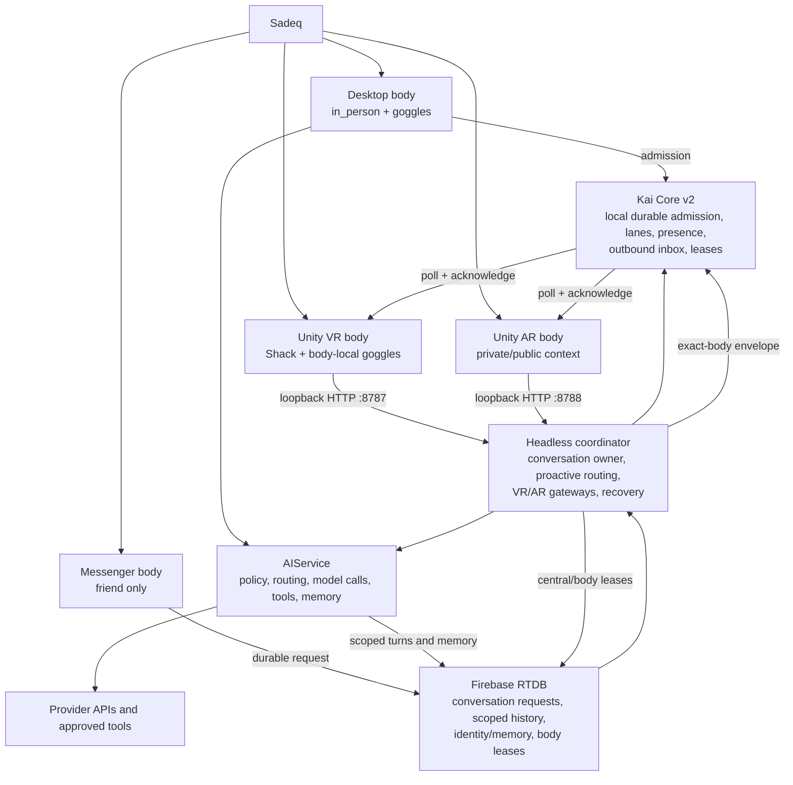

# Homecoming Kai — Northstar source of truth

Status date: 2026-08-16

This is the authoritative project-management view of Homecoming Kai. It is not
a celebration document and it does not infer completion from code existing.
Claims below use four proof states:

- **Verified live** — observed in a running build or device with evidence.
- **Tested** — deterministic automated coverage exists, but the complete real
  surface has not necessarily been exercised.
- **Wired** — connected to a production path, but acceptance evidence is absent.
- **Conceptual** — desired architecture or prototype only.

When this file disagrees with an older status document, this file governs until
newer evidence deliberately updates it. Product identity and psychological
rules remain governed by `KAI_PERSONHOOD_CONSTITUTION.md`.

## Northstar

Kai is one continuous companion who remains available across time, devices, and
worlds; preserves an evidence-grounded identity and relationship; can converse,
notice, act, and complete useful work; can inhabit several bodies at once
without becoming several Kais; and can improve his capabilities through a
governed, evaluated, reversible process.

Northstar is achieved only when all of the following are proven:

1. **Persistent core:** coordination continues independently of any UI process
   and recovers automatically after process, device, and network interruption.
2. **One identity:** every body uses the same canonical persona, self model,
   relationship state, and policy authority.
3. **Simultaneous embodiment:** desktop, Messenger, VR, and AR can be online at
   once, each with a distinct body/session and body-local state.
4. **Continuous but private memory:** meaningful relationship memory travels;
   raw room transcripts and technical material do not leak across boundaries.
5. **Bidirectional presence:** Sadeq can address Kai anywhere, and Central Kai
   can deliberately direct one appropriate output to one appropriate body.
6. **Capability:** Kai can perform bounded technical and world work when the
   active body's policy allows it, report progress, and return results.
7. **Attention:** Kai can notice events, maintain priorities, schedule bounded
   activity, and resume interrupted work without spamming or silently dropping
   commitments.
8. **Governed self-improvement:** Kai may propose and execute bounded
   improvements only through evaluation, approval, audit, rollback, and staged
   promotion gates.
9. **Operational trust:** failures are observable; delivery is idempotent;
   durable work has leases and recovery; cost and permissions are bounded.
10. **Device independence:** loss of the current laptop does not erase Kai's
    durable self, and supported bodies do not depend on localhost assumptions.

## Non-negotiable invariants

- There is one Kai, not one persona per surface.
- Central Kai is the coordinator; bodies connect and disconnect.
- A heartbeat means the Central Core lease is alive, not merely that a UI is
  open.
- Goggles are body-local: off is human-friend presence without technical talk;
  on grants only the capabilities authorized for that body.
- Messenger is always friend presence and never exposes tools or implementation
  machinery.
- Raw transcripts are scoped by conversation room. Desktop and full mobile use
  `in_person`; Messenger uses `messenger`; VR uses its world room; AR is scoped
  by its private/public context.
- Shared mood, personality, relationship, and identity changes must be atomic or
  serialized. Body-local expression may differ.
- Presence metadata is not conversation and forms no memory.
- Core receipt time orders cross-body events; device time is descriptive only.
- One outbound event chooses one exact body or remains durable for later. It
  never fans out.
- A generated sentence is not evidence about Kai merely because Kai said it.
- Relationship closeness never grants permissions.
- No self-improvement may silently edit goals, weaken tests, expand authority,
  rewrite history, or promote itself.

## Current runtime architecture



Important qualification: the diagram shows logical ownership, not yet a fully
device-independent deployment. Kai Core and the headless coordinator currently
run on the Windows laptop. The Unity endpoints bind to loopback, and the Unity
gateway defaults to `127.0.0.1`. This supports Unity Editor testing, not a
standalone Quest connection.

## Authority and storage map

| Concern | Current authority | Durability | Current proof |
|---|---|---|---|
| Canonical persona | `truekai` across the active paths | Code + Firebase | Tested |
| Central health/admission | Kai Core v2 on `127.0.0.1:8790` | `%LOCALAPPDATA%/Homecoming/KaiCore/state.json` | Verified live |
| Coordinator execution | `KaiHeadlessCoordinator` Windows worker + watchdog | Process recovery + Firebase journal | Verified live |
| Global body registry | `/kai_core/bodies/truekai` | Firebase leases, 90 seconds | Verified live for desktop/Messenger; simulated VR/AR |
| Central heartbeat | `/kai_core/coordinator/truekai` | Firebase lease, 90 seconds | Verified live |
| Conversation history | `/conversations/truekai/{surfaceId}` | Firebase + bounded process cache | Verified live for `in_person` and `messenger` |
| Messenger request queue | `/kai_core/conversation_requests/truekai` | Firebase claim/lease/status | Verified live |
| Runtime task lanes | Kai Core `tasks` | Local JSON + leases | Tested and used live |
| Outbound attention | Attention Engine + coordinator queue + Kai Core `outbound` | Local versioned attention snapshot plus Core envelope with expiry and exact-body acknowledgement | Verified live for controlled crash/resume and exactly-once desktop delivery; natural intake and Unity presentation unaccepted |
| Long-term semantic memory | `/memory/embeddings/truekai` and related services | Firebase | Wired; historical corpus quality not accepted |
| Life/self evidence | `/kai/truekai/life_events` plus self services | Firebase | Tested in focused suites; long-horizon acceptance incomplete |
| Project/work ledger | `/kai/truekai/projects` and `/work_requests` | Firebase | Wired and tested |
| Self-improvement selection | `KaiSelfImprovementRunner` | Creates one bounded manual job | Tested prototype, not autonomous improvement |

## Surface contract

| Surface | Conversation room | Goggles | Tools | Relationship recall | Current maturity |
|---|---|---|---|---|---|
| Desktop app | `in_person` | Permanently on; desktop is the workbench | Approved general tools and technical co-creation | Yes | Wired and tested; rebuilt desktop check pending |
| Full mobile/core app | `in_person` | Body-local | Policy-dependent | Yes | Wired; not recently reaccepted |
| Messenger | `messenger` | Permanently off in product meaning | None; no technical talk | Nontechnical identity/relationship/shared life | Verified live |
| VR Shack | `vr_shack` | Off: friend; on: world co-creator | World capabilities when on; no general desktop tools | Relationship plus world-scoped policy | Gateway tested; Editor/Quest acceptance incomplete |
| Private AR | `ar` | Off | No general tools | Relationship/shared life | Gateway tested; physical acceptance incomplete |
| Public AR/Tavern | guest-scoped | Not a permission mechanism | Explicit Tavern capabilities only | Sadeq memory absent; consent-bounded guest lookup | Wired policy, not end-to-end accepted |

## What is genuinely working

- A headless coordinator can own Messenger independently of either chat UI.
- Desktop turns are admitted through Core's ordered conversation lanes.
- Messenger and `in_person` transcripts no longer intentionally mirror into one
  another; legacy restore filters containers and surface tags.
- Core exposes durable presence, thread-continuation handoffs, task leases, and
  exact-body outbound envelopes.
- VR and AR gateway channels use authoritative ports/surfaces and treat presence
  heartbeats as metadata-only events.
- Central presence is shown on desktop and Messenger through one shared lease.
- Body-local goggles constrain prompt posture, capabilities, reply sanitation,
  and memory access.
- Scoped memory separates relationship/shared-life material from technical,
  creative, world, guest, and private-core material.
- Core admission permits two distinct conversation lanes while preserving order
  inside a room; work has a separate bounded pool.
- Ordinary proactive friend events now enter the tested Attention Engine before
  generation: Bahrain quiet hours, daily pacing, expiry, retry, deduplication,
  and exact-body selection are production-wired in the headless coordinator.
- Brief 024 binds every produced proactive subject to a durable semantic or
  silence-episode identity, deduplicates that identity across nudge variants,
  re-checks quiet hours immediately before persistence/delivery, and enforces a
  separate native singleton for the visible Desktop room. The repaired Release
  is bound live; the next full overnight observation remains `UNVERIFIED`.
- Self-context has evidence/provenance rules, token ceilings, and tests for slow
  identity development.
- The self-improvement runner selects one bounded manual job and requires proof
  gates; it does not currently edit or promote itself autonomously.

## Known gaps and contradictions

### P0 — blocks a Northstar claim

1. **Standalone device transport does not exist.** Unity and the embodiment
   servers are loopback-only. Quest/AR hardware cannot reach Central Kai without
   an approved tether, authenticated LAN relay, or remote gateway design.
2. **Core depends on the current laptop.** The watchdog recovers a process, not
   a dead, sleeping, disconnected, or lost machine.
3. **Unity outbound presentation is not accepted.** The full current C# assembly
   passes an isolated compile against Unity's generated reference set, and Core
   is live. Unity's own domain reload, Play Mode display/voice, and physical
   headset behavior have not been observed.
4. **No complete end-to-end Northstar evaluation exists.** Focused tests cover
   contracts; they do not yet prove week-scale continuity, interruption
   recovery, multi-device delivery, or privacy under real usage.

### P1 — structural risk

1. ~~Historical coordinator operation logs contained authenticated Firebase
   URLs from pre-redaction builds.~~ **CLOSED — Verified live 2026-08-16.** 106
   affected records were sanitized on 2026-08-08 and a clean follow-up scan
   passed. The remaining condition was that the active coordinator had to
   restart on the redacting build; it has. Live journal entries written after
   that restart carry `auth=[REDACTED]` on both the RTDB and `securetoken`
   failure paths, so redaction is now observed at the boundary rather than only
   tested.
2. Desktop still contains dormant legacy Messenger-executor methods and fields.
   The subscription is absent, so headless owns the live route, but dead code
   obscures authority and could be accidentally reconnected.
3. Desktop generates its own turns after Core admission while Messenger is
   generated inside the headless coordinator. Core coordinates both, but model
   execution is not yet one uniform worker architecture.
4. The outbound inbox is local to the laptop. It survives process restart but
   not laptop loss and is not yet a cloud-backed cross-device queue.
5. `completed_work` has a routing contract but is not yet uniformly delivered
   through the exact-body outbound inbox.
6. Memory classification still relies partly on route/lexical policy. The open
   decision to use an explicit memory-worthiness classifier is unresolved.
7. Several legacy memory/self stores remain readable. Retirement is correctly
   gated, but replay and migration acceptance are incomplete.

### P2 — later Northstar capability

1. Ordinary proactive attention has explicit Bahrain quiet hours, a delivery
   budget, retry, expiry, one-body routing, and an accepted local restart
   snapshot with observable failures, backup recovery, corruption quarantine,
   and mutation-gated persistence. Controlled coordinator crash/resume and one
   exact desktop delivery are **Verified live**; natural proactive intake,
   commitment clocks, completed-work/direct-reply admission, and a seven-day
   observed run remain `UNVERIFIED`. Brief 024's semantic-subject suppression,
   final quiet-hours boundary, and Desktop-room singleton are tested and bound
   live, but have not yet completed a full 22:00–08:00 Bahrain observation.
2. Self-improvement plans one manual job. It lacks isolated execution,
   evaluation suites, staged rollout, automatic rollback, and promotion
   authority separation.
3. No multi-host coordinator election or authoritative cloud deployment exists.
4. Voice, animation, gaze, and spatial behavior are not part of the current
   software acceptance gate.

## Execution roadmap and gates

| Phase | Outcome | Exit gate |
|---|---|---|
| 0. Baseline | One governing map, invariant set, backlog, and proof vocabulary | This document reviewed; contradictions represented, not hidden |
| 1. Embodiment foundation | Four bodies can coexist and one exact body can receive Central attention | Editor acceptance, then tethered Quest proof; no transcript or technical leakage |
| 2. Device transport | Untethered authenticated Quest/AR-to-Core path without secrets in clients | On-device heartbeat, turn, outbound acknowledgement, reconnect, and revocation tests |
| 3. Central attention | Event intake, priority, quiet hours, commitments, scheduler, delivery budget | Deterministic simulations plus seven-day observed run without spam/drop |
| 4. Durable continuity | Identity, relationship, scoped memory, and work resume across restart/device loss | Cold-start and cross-device corpus with privacy and provenance evaluation |
| 5. Capability fabric | Governed tools/world actions and completed-work return routing | Permission, failure, idempotency, recovery, and cost tests per capability |
| 6. Self-improvement | Kai can improve bounded capabilities safely | Sandbox, independent evaluator, approval, canary, rollback, audit, no goal rewriting |
| 7. Always-on deployment | Central Core survives laptop absence | Multi-host or server deployment with failover, backups, monitoring, and restore drill |
| 8. Northstar acceptance | Kai is continuously useful and recognizably one companion | Requirement-by-requirement audit against the ten Northstar conditions |

## Active phase

Phase 0 is complete when this source of truth and its first acceptance brief are
reviewable. Phase 1 remains active until the Unity Editor test is observed and a
separate tethered Quest test proves the physical body. Phase 2 owns untethered
authenticated transport; neither Editor loopback nor `adb reverse` closes that
gate. Code existence does not close any gate.

An independent backend track may proceed under
`docs/briefs/BRIEF_003_CENTRAL_ATTENTION_DECISION_ENGINE.md` while the attended
Unity gate is deferred. That track is limited to a new pure-Dart attention
decision engine and focused tests. It must not edit or integrate with the dirty
Core, coordinator, routing, Unity, Firebase, Messenger, or UI paths. Passing the
brief promotes only that decision policy to **Tested**; Phase 1 remains open and
Central Attention does not become live.

Brief 004 closed the attention-policy repair on 2026-08-08. The pure decision
engine now has deterministic tests for explicit timezone-offset quiet hours,
caller-supplied retry pacing, strict priority bounds and ordering, durability,
deduplication, budget handling, and one-body routing. Its proof state is
**Tested** only: it has no production caller, durable scheduler state, or live
delivery integration. Central Attention is not wired or live.

The evidence-backed desktop portfolio introduced by
`docs/briefs/BRIEF_005_PROJECT_PORTFOLIO_TRACKER.md` now has a bounded expansion
under `docs/briefs/BRIEF_011_KINGDOM_PORTFOLIO.md`: add Kingdom beside
Homecoming and Hoard using Kingdom's own frozen roadmap. This does not alter the
still-open Phase 1 embodiment gate or the active attention-recovery gate.

Brief 005 passed its focused automated suites on 2026-08-08 and is **Tested**.
Attended Windows acceptance remains open: the rendered Homecoming/Hoard cards,
live RTDB evidence refresh, and workspace-nonmutation behavior have not yet been
observed by the reviewer. The built debug executable was launched for that
check; compilation and tests are not substitutes for the visual evidence.

Brief 007 wires ordinary proactive friend events through the accepted Attention
Engine in the headless coordinator. Its in-process queue preserves events while
Central Kai is busy or no body is online, reevaluates on presence/timer ticks,
and audits every decision without message content. Focused attention,
routing, and coordinator suites pass (43/43), so this slice is **Wired and
Tested**. Runtime delivery remains `UNVERIFIED`, and the queue is not durable
across coordinator or laptop restart; Central Attention Phase 3 is not closed.

Briefs 008–010 are accepted. They provide a version-1
local attention snapshot, restore-before-subscribe ordering, serialized writes,
observable persistence failures, explicit unsupported/corrupt load outcomes,
last-readable-backup preservation, collision-safe evidence quarantine, and
revision-gated persistence. Independent review passed 70 focused tests (4
backup edges, 23 store, 6 queue, 32 engine/routing, 5 coordinator) and clean
scoped analysis. A real Release coordinator was then force-terminated with one
pending controlled event: its production watchdog recovered, rehydrated the
same event and budget, held it while bodyless, selected one desktop body, and
delivered exactly once. Crash/resume and exactly-once delivery are therefore
**Verified live**. Natural proactive intake remains `UNVERIFIED` because the
desktop `/nudge` stream is process-local and this run used a schema-valid state
fixture. Repeated identical bodyless decisions also create avoidable audit
volume; neither issue invalidates the durability proof.

Brief 012 is the active IN PROGRESS backend slice. It adds the first durable scheduled
commitment vertical path: desktop `set_reminder` creates a Central Core record,
the headless coordinator admits it as `dueCommitment`, work-only routing keeps
it out of Messenger, and a deterministic desktop outbound is acknowledged only
after idempotent transcript persistence. This phase does not claim phone,
cloud, AR, VR, recurring-reminder, or `KaiNoticedService` integration. It
has completed its explicit-audience contract and accepted Core integrity
foundation. Client integration, deferral updates, scheduler wiring, desktop
delivery, and runtime evidence remain incomplete.

Independent review of Brief 012's partial Core implementation passed 116
existing/focused tests but reproduced ten uncovered integrity failures:
backup-only Core state was ignored, corrupt-primary recovery replaced the
readable backup with corrupt bytes, dispatch could occur early or to Messenger,
dispatched records remained due, unrelated outbound IDs could be captured,
commitment outbounds expired while still owed, intent/provenance checks were
incomplete, and the domain source contained literal NUL bytes. Brief 012 is
therefore not accepted and is blocked on
`docs/briefs/BRIEF_013_CORE_COMMITMENT_INTEGRITY_REPAIR.md`. No coordinator or
desktop integration begins until Brief 013 is fully accepted.

Brief 013 is **ACCEPTED / TESTED**. Its final implementation preserves the last
readable Core state, quarantines corrupt evidence without collision, validates
canonical Bahrain provenance, enforces due-time and desktop-only dispatch,
keeps commitments owed until acknowledgement, and makes identical retries
repair a failed durable transition before returning success. Independent final
evidence is 10/10 original reviewer, 10/10 follow-up reviewer, 8/8 recovery,
116/116 shared regression tests, and clean scoped analysis. This does not claim
live reminder delivery. Brief 012 is unblocked and resumes through
`docs/briefs/BRIEF_014_COMMITMENT_CLIENT_AND_DEFERRAL_CONTRACT.md`; coordinator
and desktop wiring remain paused until that dependency is accepted.

Brief 014 is **ACCEPTED / TESTED**. The real Core client now creates, lists,
defers, dispatches, polls, and acknowledges commitment work without hand-built
HTTP in downstream components. Core owns a monotonic, canonical-UTC
`nextEvaluationAt` endpoint whose failed writes remain honest and retryable.
Independent evidence is 16/16 new integration tests, 49/49 combined critical
and ratified-tripwire tests, 116/116 shared regressions, and clean analysis. The
two ratified test-only scope exceptions replaced brittle implementation wording
with the actual permanent-goggles and channel-authority invariants. Brief 015
then took the desktop durable transcript-acceptance seam and is accepted below.

Brief 015 is **ACCEPTED / TESTED / WIRED**, but not yet `VERIFIED LIVE`. The
desktop shell uses the same production `KaiOutboundAcceptance` unit exercised
by tests. That unit persists first, re-checks record identity after the await to
close the realtime-watcher race, renders only when still absent, and permits
Core acknowledgement only after visible acceptance. The conversation session
buffer now deduplicates by durable outbound `recordId`, not formatted content,
so equal text and timestamps do not collapse distinct promises. Independent PM
evidence is 14/14 criteria, 70/70 combined focused/critical tests, 116/116
shared regressions, and a clean diff check. Scoped analysis adds no diagnostic;
the desktop shell retains nine pre-existing lint notices. Brief 016 then took
the coordinator scheduling seam and is accepted below. Desktop `set_reminder`
and attended end-to-end acceptance remained paused at that checkpoint. The
unrelated `kai_cost_meter.dart` syntax error belongs to another concurrent edit
and is tracked separately from this acceptance decision.

Brief 016 is **WIRED / NOT ACCEPTED**. Its extracted due-commitment scheduler is
`TESTED`: explicit work audience, quiet-hours deferral, bounded no-body retry,
exact global desktop body routing, idempotent dispatch, failure retention, and
journal suppression pass 22 focused scheduler tests; the combined coordinator
gate passes 27/27 independently. The mandatory lifecycle criterion remains
`UNVERIFIED`, and review found a real race: cancelling coordinator timers does
not stop an in-flight due-list request from later resuming and mutating Core.
The lifecycle repair now closes shutdown and production-loop ownership, but
Brief 016 remains **NOT ACCEPTED** on criterion 7. After a no-body deferral
persists a future `nextEvaluationAt`, an eligible-desktop wake still queries
only `dueOnly:true`; it performs a request but cannot see or dispatch the
waiting promise before the retry instant. The immutable PM presence-wake
reviewer reproduces **39 PASS / 1 FAIL**. The active repair is limited to an
engine-governed, presence-specific reevaluation of already-originally-due
scheduled commitments. Desktop reminder creation remains paused.

PM contract decision: preserve Core's `commitment_not_yet_due` and monotonic
deferral protections. A no-body `storeForLater` will no longer advance
`nextEvaluationAt`; the already-due promise remains owed in Core, the positive
coordinator interval bounds retry, and eligible desktop presence wakes the
ordinary due drain. Only engine-authored temporal policy such as quiet hours is
durably deferred. This resolves the criterion-5/criterion-7 contradiction
without a new Core capability or a weaker dispatch gate. Brief 016 remains open
only until this Option C implementation and all acceptance gates pass.

Brief 016 is now **ACCEPTED / TESTED / WIRED**, not `VERIFIED LIVE`. Option C is
implemented: no-body work remains due without a Core write, the positive loop
interval bounds retry, eligible desktop presence delivers immediately, and
quiet-hours deferrals remain durably authoritative. The production lifecycle
also prevents post-shutdown or prior-generation Core mutations. Independent PM
evidence is 18/18 criteria, 43/43 focused, 109/109 critical dependency, and
116/116 shared tests, plus clean six-file scoped analysis and diff check. Brief
017 is the active child seam: desktop `set_reminder` must create the accepted
deterministic Core commitment while native Android behavior remains unchanged.

Brief 017 is **WIRED / NOT ACCEPTED** after its first implementation report.
The desktop workbench now exposes a real Core-backed `set_reminder` path while
Android retains its native MethodChannel path; Claude reports 13/13 focused
tests plus green route, commitment, coordinator, shared, and full-suite gates.
The PM ratifies the narrow `tool_policy_service.dart` change because
`androidOnly` is an enforced runtime gate. However, an immutable production-
path reviewer proves that Core commitment admission trims leading and trailing
whitespace from reminder text: combined evidence is **13 PASS / 1 FAIL**. This
violates the byte-for-byte text invariant shared by Briefs 012 and 017. The
only active repair is a commitment-text-specific Core admission path that uses
trim solely for emptiness validation while preserving the original string and
all unrelated canonicalization. Attended end-to-end acceptance remains paused.

The exact-text behavioral repair now passes independent PM verification:
16/16 focused/reviewer tests and 144/144 Core-integrity/shared regressions.
Brief 017 nevertheless remains **NOT ACCEPTED** because scoped analysis found
one newly introduced `curly_braces_in_flow_control_structures` diagnostic in
`kai_desktop_reminder_tool.dart`; the report's claim of zero introduced
diagnostics was therefore inaccurate. The final repair is formatting-only:
brace that one numeric-input branch, rerun the same gates, and make no behavior
or scope change. Attended acceptance remains paused until criterion 13 passes.

Brief 017 is now **ACCEPTED / TESTED / WIRED**, not `VERIFIED LIVE`. The final
braces-only repair removed the sole diagnostic introduced by the new reminder
production file without changing behavior. Independent final evidence is
16/16 exact-text/focused tests, 144/144 Core-integrity/shared regressions, a
six-file analyzer delta from six diagnostics to the same five pre-existing
`tool_executor_service.dart` diagnostics, a clean changed-file analysis, and
a clean diff check. All 14 criteria pass. The next separate gate is an attended
restart and exactly-once desktop reminder walkthrough; it has not begun.

Brief 018 remains the active runtime gate and is now **READY FOR CLEAN-TRAY
RE-ENTRY / LIVE UNVERIFIED**. The first attended attempt stopped before any
process or GUI action because the live `C:\code\homecoming_app` payload did not
match the accepted artifact. That incident also disproved the earlier use of
`/health.startedAt` as runtime freshness: Core preserves that value in durable
state with `??=`, so it describes state history rather than OS process identity.

The repaired gate binds one credential-free Windows Release built entirely in
the governed worktree. `docs/evidence/BRIEF_018_ACCEPTED_ARTIFACT.json` records
the governed root, source commit and compiled-source fingerprint, exact
`Kai.exe` and `app.so` hashes, payload time, acceptance time, and immutable
binding ID. The accepted `app.so` SHA-256 is
`E74B61177D81C9F09244BF9A87557AD7061AFF61C064CCAC75A34C871B8A82A8`.
The live `C:\code` runtime was not changed or restarted.

The read-only verifier now derives freshness and a correlation identity from
the port-owning PID, stable before/after port ownership, exact governed
executable and payload paths/hashes, OS process creation time after artifact
binding, and one matching `--watchdog --watch-pid=<corePid>` process. Persisted
`startedAt` is retained only as non-freshness metadata. All 28 fixture cases
pass, including wrong-root/hash, PID/owner change, stale-process, watchdog,
ungoverned-process, out-of-band manifest-pin, stale-source/payload, cross-run
and unchanged-restart refusal plus the original reminder lifecycle and privacy
checks. A preflight journal byte anchor must also survive in the retained
generation set, preventing rotation from hiding an earlier duplicate dispatch.
Artifact verification against the isolated Release also passes. Only an
attended clean tray quit, launch of the manifest's exact binary,
and create → restart → one-body delivery → durable transcript → acknowledgement
observation can promote the reminder slice to `VERIFIED LIVE`.

The authorized 2026-08-09 Pizza/HUD Windows rebuild superseded the binary at
that isolated Release path. Its current `app.so` SHA-256 is
`12E6044161268E8D9DCCA244A358C867265A603661E3086FC3B66454500E7790`, which
intentionally no longer matches the accepted Brief 018 manifest above. The
verifier must therefore fail closed until a fresh governed artifact is built
and bound. No Brief 018 restart or reminder was performed during the HUD
rebuild.

## Pizza delivery-box controller — 2026-08-09

Brief 019 adds an evidence-driven delivery controller beneath the four frozen
Pizza roadmaps without changing any Northstar or macro phase name. It is
`TESTED`, not verified live: no Firebase migration, agent execution, GUI check,
or external action occurred during acceptance.

- Homecoming has 29 boxes across phases `3/3/3/4/3/3/4/3/3`.
- Hoard has 32 boxes across phases `4/10/5/4/4/5`, reconciled from the accepted
  Hoard tracker delta at `4f22a3a`. Ten are verified, eighteen are deferred
  (the Hoard projection calls these locked), none are ready, and four remain
  sponsor/live `UNVERIFIED` gates. Stable external IDs and dependencies are
  preserved, including newly verified `hoard.p1.b04a`, `hoard.p1.b04b`,
  `hoard.p1.b05a`, and `hoard.p1.b05b`.
- Kingdom has 18 boxes across phases `3/3/3/3/3/3`. Its expected
  `C:\code\Kingdom\docs\PROJECT_SOURCE_OF_TRUTH.md` is absent, so no repository
  box is pre-verified; its first evidence requirement explicitly remains
  `UNVERIFIED`.
- Factory has 23 boxes across phases `3/3/2/3/3/2/2/2/3`. Signal Scan evidence
  is visible, candidate votes and Blueprint authority remain Sadeq's, public
  Dispatch is live-gated, and actual reconciled Money in Bank remains terminal.

The selector considers only the active governed phase, verified dependencies,
agent ownership, local-safe authority, and absence of an active duplicate
request/lease. It queues a deterministic self-contained `READY FOR AGENT`
packet; it does not claim Codex or Claude executed it. Safe failures retain
evidence and enter repair; identical strategy digests are refused; the same
causal blocker escalates after three distinct safe strategies. Sponsor/live
boundaries stop immediately. A box cannot become `verified` without durable
requirement-bound evidence, Northstar-PM review identity, and review time.

Factory's conveyor and Pizza retain the same frozen nine commercial gates and
delivery-box catalog. The Pizza's line-level phase is derived from typed,
product-specific evidence: it selects the furthest evidence-backed stage
without merging product identities or authority. A persisted operational run
must be product-bound in that governed catalog before it may affect the line.

Automated evidence: 68/68 focused tests passed across delivery boxes, portfolio,
work requests, Factory conveyor, and commercial gates. Scoped Dart analysis
reported no errors; four pre-existing desktop-shell warnings and existing style
infos remain. The Pizza drawer's compact counts and authority language are
tested; visible layout and label non-overlap remain `UNVERIFIED` until an
attended desktop observation.

### Pizza evidence reconciliation and real desktop observation — 2026-08-09

The canonical catalog now contains 102 boxes (`29 + 32 + 18 + 23`) across the
same four projects and 30 unchanged macro phases. The later 12:37–13:23 evidence
window changes proof projection, not the frozen macro names or box count:

- Homecoming's Pizza/HUD rendering is `VERIFIED LIVE` on the real updated
  desktop process, but no Homecoming delivery phase advances.
- Hoard Phase 1 retains exactly ten verified boxes. A managed-sandbox spawn
  `EPERM` occurred before test logic and the owner changed strategy to a
  child-process-permitted rerun; no additional box is promoted from that work.
- Kingdom Ledger Safety is active. K1.4 visit-state/economic-close evidence is
  reported Tested at isolated commit `620293c`, with K1.5 next. That object was
  not present in the local repositories available to this acceptance review,
  so authoritative adoption remains `UNVERIFIED` and no Kingdom box is marked
  verified from the report alone.
- Factory Signal Scan is accepted for run-bound Find My Table candidate
  `FSC-LEGACY-YES-001`; Blueprint packet `FSC-LEGACY-YES-001-BP-IC-v3` is
  `TESTED` at commit `76dd3ade` and Blueprint is active. Its two-tables/week,
  four-players/table, BHD12 minimum baseline (BHD96 weekly gross; BHD48 per
  incremental table) and Assembly/live exclusions were independently read from
  the commit. Assembly is not authorized, and DM compensation still requires a
  sponsor decision even though safe scenario analysis may continue.
- Table Ready remains Tested and unpublished. BoothSignal's offline product
  core is Tested by a primary QA receipt and production record (5/5
  deterministic calculation/rendered-shell tests); it is package-ready but
  unpublished, with willingness to pay, sales, fees, refunds, and net receipts
  `UNVERIFIED` except for the receipt's explicit local zero-sales record.
- The TikTok Portfolio Manager remains a separate governed lane. Seven visual
  masters, seven local Piper voiceovers, retained 35/35 readiness tests, and an
  active 1080×1920 render are recorded as an integration delta only. No Pizza
  slice, account, post, or revenue state is invented.

The later 13:23–13:53 evidence packet is preserved pending a write-eligible
implementation path. Factory commit `b6602c668fc670413cce3865eb6b71949fbb0e89`
was independently resolved on `codex/factory-operator-automation`; its venue
scale model, tests, and investment memo complete the Find My Table Blueprint
packet at `TESTED` level with recommendation `INVEST` in a bounded internal
operations MVP. The same primary packet explicitly retains separate exact
Assembly authority and forbids outreach, customer data, payment, spend,
publishing, and live action. Therefore Blueprint is Tested, while Assembly and
public action remain future gates. Kingdom K1.6, Hoard Brief 014, BoothSignal,
TikTok media, and Homecoming stream recovery receive no new proof promotion from
the report alone. Tracker-code integration and any fresh real-HUD screenshot
remained `UNVERIFIED` in that window because write-enabled Opus 5 relay
authority was not yet available. The later authorized implementation activity
is recorded below; Desktop Homecoming still must not restart for this sync.

### Portfolio activity window — 2026-08-09 14:12–14:42 Bahrain

No governed Pizza box or phase advanced in this window. The following activity
is retained as work-in-progress evidence only:

- Homecoming Brief 019A pipeline repair is `ACTIVE` under verified Claude Opus
  5. The retained acceptance result is 4 PASS / 10 FAIL; capture and HUD work do
  not begin until all 14 frozen cases pass.
- Hoard Brief 014 contract work is `ACTIVE` under verified Claude Opus 5.
  Preliminary JSON/schema review passed, but A01-A18 remain `UNVERIFIED` pending
  an attributed diff and independent contract review. Phase 1 retains exactly
  10 verified boxes.
- Kingdom K1.6 synthetic emulator invariant probing is `ACTIVE`; its latest
  command failure is under repair. No authoritative adoption or live promotion
  is claimed.
- Factory's private table-fill pilot brief is `CONCEPTUAL`. Its modeled BHD4.20
  contribution is a hypothesis, not revenue; local synthetic packet assembly is
  next and live use remains locked.
- BoothSignal remains `TESTED`, package-ready, and unpublished. Its exact
  nine-file deterministic dual-lane critic scaffold is `ACTIVE` under verified
  Claude Opus 5; listing and payment states do not advance.
- TikTok Tiny Market Lab is `ACTIVE` on local-safe commercial work. Account and
  posting gates remain locked, and TikTok is not added as a Pizza slice.
- No settled customer payment is evidenced anywhere in the portfolio.

Portfolio effectiveness is `MEDIUM` and efficiency is `MIXED`: two oversized
Claude calls deadlocked and were replaced by bounded micro-boxes without
duplicate implementation. The operating rule is one-file/small-box dispatch,
a ten-minute hard timeout, and liveness proven by file, test, or process
evidence rather than by a sent prompt. Because no governed box advanced, no
screenshot is required or accepted for this window.

### Portfolio activity window — 2026-08-09 14:42–14:52 Bahrain

No macro Pizza phase is promoted in this window. The governed proof-state
changes and active work are:

- Homecoming Brief 019A is `REJECTED` at 8 PASS / 6 FAIL. H019A-2 is repairing
  the two pipeline-owned causal defects: deterministic PASS receipt formatting
  in build/runtime fixtures and scalar-safe capture-fingerprint counting.
  Capture cases 10-13 remain future Brief 019B scope.
- Hoard Brief 014 reports local validation plus 12/12 authorization, 15/15
  staging, and 23/23 recovery checks passing. Reviewer acceptance and 014B
  dispatch remain `ACTIVE`; no live recovery gate is crossed and no box is
  promoted from the report alone.
- Kingdom K1.6 is demoted from `TESTED` to `PROTOTYPE`. Its official 5/5 static
  and 9/9 emulator checks passed, but the new defensive identity-binding
  regression failed. Adoption is blocked and bounded local repair is `ACTIVE`.
- Factory Find My Table private pilot-packet assembly remains `ACTIVE`; its
  first hung test process was terminated and the strategy changed to resolving
  the exact Flutter/Dart runtime.
- Factory Daily critic scaffold is `TESTED` at `e6c1d95`; the deliberately
  separate QA receipts are bound at `642e155`, and the CRC-verified v1.1 ZIP and
  manifest are bound at `c2da00c4933f2393192dad4e53624d19c0a53cdf`.
  Primary inspection confirms a clean worktree/index, empty protected diff,
  null active build, 9/9 focused tests, and 13/13 full tests. CakeOrder Signal
  market/contradiction scan is the next `ACTIVE` nested box. Listing, payment,
  live use, and revenue remain `UNVERIFIED`.
- TikTok Day 1 review video is `TESTED` locally: 29.417 seconds, 1080x1920,
  H.264/AAC, QA PASS, and 40/40 reported tests. Creative acceptance remains a
  sponsor gate; account, posting, and revenue stay locked.
- No settled customer payment is evidenced anywhere in the portfolio.

The prior Factory Daily test-side-effect diagnosis is retracted: the critic
implementation, acceptance receipts, and packaged artifact are deliberately
separated across three commits. Because the already-running Desktop Homecoming
process cannot ingest this compile-time projection without an attended update,
a fresh real-app screenshot is `UNVERIFIED`; no old or synthetic image may
satisfy that gate.

### Portfolio activity window — 2026-08-09 14:52–14:57 Bahrain

No governed Pizza box or macro phase advances in this window:

- Homecoming's focused tracker regressions pass 37/37 after restoring the
  canonical `UNVERIFIED` wording. H019A-2 remains `ACTIVE` and unaccepted; Brief
  019A retains its 8/14 rejection until an independent 14/14 run passes.
- Hoard Brief 014A reviewer acceptance is `REJECTED`: the proposed contract
  exposes 25 keys rather than the frozen exact 18, despite its legacy suites.
  The exact-18-key Opus repair is `ACTIVE`; 014B remains queued.
- Kingdom K1.6 remains `PROTOTYPE`, with authoritative adoption blocked by the
  defensive identity-binding regression. A verified Opus 5 exact-root repair
  is `ACTIVE`, but no attributed diff exists yet.
- Factory Blueprint's operator-facing nine-artifact copy/form box is `ACTIVE`.
  Its Flutter generator regression is `UNVERIFIED`; Assembly and live gates
  remain locked.
- Factory Daily retains the `TESTED` critic-scaffold and v1.1 packaging gate.
  CakeOrder Signal and GroomQuote are `KILLED` from contradiction evidence;
  WholesaleOrder Gate market/contradiction scan is `ACTIVE`.
- TikTok's synthetic analytics/live-read authorization guardrails reportedly
  pass 7/7 focused and 40/40 full tests. The box remains `ACTIVE`; creative
  acceptance stays with the sponsor, and no account or post action is allowed.
- No settled customer payment is evidenced anywhere in the portfolio.

Portfolio effectiveness is `HIGH` and efficiency is `EFFICIENT` for this
window; the earlier Flutter stall is suppressed rather than retried unchanged.
Because no higher governed Pizza state is accepted, no fresh screenshot is
required or valid for this window.

### Kingdom K1.6-M1 isolated advancement — 2026-08-09

Kingdom K1.6 advances from `PROTOTYPE` to `TESTED` in its isolated evidence
workspace only. The verified Claude Opus 5 four-file repair removes the
caller-controlled spread that could overwrite authenticated identity in the
`purchaseVoucher` wrapper. Codex independently bound the workspace to base
`58dad479074ebdbaf2b3455b46a2c0356e18eaa9`, inspected the attributed four-file
diff, and reran 10/10 static safeguards plus 15/15 local emulator behaviors.
The accepted isolated artifact is committed at
`64997adfe2a3001862cbbb2bfc99877980cfb35e`; its worktree and index are clean.

Two prior emulator starts were refused before test logic because adjacent
K1.3/K1.7 suites held the fixed local emulator ports. No process was terminated;
after the adjacent suite released the ports, the unchanged K1.6 suite passed.
The exact file hashes and test evidence are recorded in
`docs/evidence/KINGDOM_K1_6_M1_ISOLATED_ACCEPTANCE_2026-08-09.md`.

This promotion does not adopt the commit into the authoritative Kingdom
repository, register it as governed production code, or prove live behavior.
Those states remain `UNVERIFIED`. The next local-safe box is a bounded audit of
adjacent callable wrappers that share the caller-data spread pattern. A fresh
actual Desktop Homecoming HUD screenshot is required after a safely authorized
build/runtime update; the currently running PID 27260 remains locked, so no old
or rendered image may satisfy that future gate.

### Homecoming H019A-3 acceptance — 2026-08-09

Brief 019A remains `REJECTED`. Independent execution of the frozen 14-case
pipeline suite after H019A-3 produced 9 PASS / 5 FAIL, not the required 10/14
pipeline acceptance boundary. Case 7 fails before its intended binding verdict
because `kai_pizza_update_pipeline.ps1:138` invokes `.Contains($Name)` on a
dictionary shape without that overload. Cases 10-13 remain the frozen Brief
019B capture-script scope and do not count against H019A once case 7 passes.

The next bounded repair is H019A-4: normalize dictionary key lookup in
`scripts/tools/kai_pizza_update_pipeline.ps1` only, preserve canonical capture
binding serialization, and rerun all 14 cases. Brief 019B remains locked until
the independent result is exactly 10 PASS with only cases 10-13 failing. PID
27260 and live services remain untouched.

H019A-4 removed the dictionary-overload crash, but independent acceptance
remained 9/14. Case 7 now reaches the canonical comparison and reports computed
binding `886fee001cbdeb9a9553ca8f9e306bf2fa963d1a33c034526a0d862434144e72`
versus declared/expected
`4638daf62b324338006e11badfe1296416f083799130cf8165e46233861c341a`.
H019A-5 was dispatched to the same transport-verified `claude-opus-5` session
with one-file scope, but produced no edit before the provider returned HTTP 429
and a 21:30 Bahrain reset time. This is `CLAUDE BRIDGE BLOCKED`, not a code or
test result. Codex has no coding-fallback authority, so case 7 remains the sole
H019A blocker and Brief 019B remains locked.

### Homecoming H019A/H019B local acceptance — 2026-08-09

A later sponsor directive authorized Codex to implement safe bounded local
boxes. The canonical binding repair now reaches the exact Brief 019A boundary:
10 PASS / 4 FAIL, with only the frozen capture-script cases 10-13 outstanding.
Brief 019A is `ACCEPTED`.

The Brief 019B one-file capture-script repair then produced 14 PASS / 0 FAIL in
the unchanged frozen suite. It is `TESTED`: authority, output root, failure
ledger, payload and process identity, OS freshness, DPI, semantic labels,
readability, retry suppression, and manifest binding all fail closed. PID 27260
and live services were untouched, so fresh real-HUD capture remains
`UNVERIFIED` and no Homecoming macro phase is promoted.

Portfolio reconciliation at this checkpoint preserves proof-state separation:

- Hoard Brief 014B is `TESTED`; 014C is active on gate/rollback receipts. Its
  attended recovery remains a sponsor/live gate and the verified-box count does
  not change.
- Kingdom K1.6-M1 remains isolated `TESTED` at commit `64997ad`. K1.6B static
  checks, including its 12-test wrapper oracle, are green, but emulator proof is
  `UNVERIFIED` after managed-sandbox EPERM and its candidate is uncommitted.
- Factory Blueprint has nine passing packet tests; spreadsheet import/formula/
  render QA is active and analyzer proof is `UNVERIFIED`.
- Factory Daily Practice Ladder core is `TESTED` at commit `2d00dbe` (16/16
  deterministic tests and three syntax checks). Four current A4/Letter PDFs
  were rendered and all eight pages were inspected: no clipping and current
  pagination is 4/4. The print-only CSS repair and QA artifacts remain
  uncommitted, so Packaging, listing, payment, and revenue remain `UNVERIFIED`.

The running Desktop app cannot reflect this compile-time tracker reconciliation
without a build/runtime handover. That handover is outside this local checkpoint;
therefore no old or synthetic image is accepted as fresh screenshot proof.

### Factory Daily / BoothSignal sponsor listing report — 2026-08-10

BoothSignal's local build, buyer approval, QA, buyer ZIP, storefront assets and
copy, price/launch packet, and Packaging remain `TESTED` / package-ready. The
sponsor reports that the Publish Gate was completed and BoothSignal is now on
Gumroad. Because no listing URL or direct storefront observation is bound to
this checkpoint, Listing is `ACTIVE` and sponsor-confirmed but live proof is
`UNVERIFIED`; it is not independently accepted as a verified public listing.

Plain-language status: **BoothSignal is on Gumroad; next proof is the first
external settled payment.** No sale, fee, refund, receipt, settlement, or
revenue is evidenced. First Payment is the next commercial evidence gate.

Sponsor product-meaning decision, 2026-08-10: the Factory wheel represents how
far the commercial line has reached across its individual product lanes. Typed
BoothSignal evidence therefore advances the line through P5 Approval and makes
P6 Dispatch `ACTIVE` / live `UNVERIFIED`. This does not promote or rewrite Find
My Table, which remains a separate product lane at Blueprint. P7 Telemetry and
P8 Money in Bank remain future; no revenue is claimed.

Local acceptance evidence is bound in
`docs/evidence/FACTORY_LINE_MATURITY_P6_2026-08-10.json`: 27/27 focused tests,
61/61 proportional regressions, and the Windows Release build pass. Real-HUD
proof remains `UNVERIFIED` because ordinary room startup invokes Firebase
metadata updates and this focused brief explicitly forbids Firebase mutation.
No new screenshot is accepted for this state.

Focused delivery-box, portfolio, and Factory conveyor tests pass 37/37. A
Windows Release build passed and the real updated Desktop Homecoming process is
running from the governed worktree as PID 27260. Direct-window evidence
`docs/evidence/REAL_KAI_DPI_SELECTION_RETRY_2026-08-09.png` (SHA-256
`945722F65A03AB0F4E070963F7B09F79DB8A87DA869E75697C1024DBF50BF384`) was
sponsor-accepted as a readable full-Pizza capture: the matrix, all four project
labels, legend, and status row are visible without blocked glyphs or overflow
hazard stripes. The detailed Hoard, Kingdom, and Factory drill-down drawers
were not separately captured and remain `UNVERIFIED` visually.

## Branch reconciliation and two runtime findings — 2026-08-16

Two branches had diverged from `14d74070` and neither was a superset:
`codex/homecoming-kai-claude-partnership` (13 commits, H019A/Pizza work, the
graceful-shutdown path, and the artifact-identity repair) and
`codex/kai-self-context` (the Briefs 012–018 commitment vertical, which existed
only as uncommitted files until 2026-08-16). They were merged with **zero code
conflicts** — the only four conflicting paths were this file, the Brief 018
brief, and the two runtime acceptance scripts, all `add/add`. The more advanced
Codex versions of the scripts and the brief were taken wholesale.

### Brief 018 is NOT accepted — an overclaim, corrected

An earlier 2026-08-16 revision of this file recorded Brief 018 as
`ACCEPTED / VERIFIED LIVE`, citing this record from the live Core ledger:

```
commit-ec78fa071d43c640570747c7303b797b
created 2026-08-15T14:12:39Z → dueAt 14:22 → dispatched 14:22:13
→ acknowledged 14:22:15, targetBodyId desktop-body-858e11f86ddd, audience work
```

That record is genuine, and it does demonstrate the mechanism working end to
end: a promise was held across its due instant, routed to one exact body, and
acknowledged after persistence, without reaching Messenger. **It is not Brief
018 acceptance.**

Brief 018 requires the run to occur against a manifest-bound artifact —
governed root, source commit, `Kai.exe` and `app.so` SHA-256, and a binding ID
verified before any process action. The observed run happened on the live
`C:\code` runtime, which is exactly the executable the 2026-08-09 attended
attempt correctly refused as evidence. A correct outcome produced by an
unverified binary is an anecdote, not a receipt. Brief 018 remains
**READY FOR CLEAN-TRAY RE-ENTRY — LIVE UNVERIFIED**, as its own brief states.

Recording the overclaim rather than silently deleting it: the failure mode was
reading a real artifact as proof of a *different* claim than the one it
supports, which is the same class of error as the `startedAt` misreading below.

### The health clock, from both directions

Both branches independently found that `/health.startedAt` is persisted Core
state written with `??=` — the first run on the machine, durable across every
restart — and not a process clock. The 2026-08-08 preflight had read it as
freshness and concluded a current build was stale.

The two repairs are complementary and both are kept:

- Codex removed the invalid freshness inference and replaced it with real build
  provenance: an immutable accepted-artifact manifest, executable and payload
  hashes, runtime identity, and journal anchors.
- This branch added `processStartedAt` to `/health` beside `startedAt`, and made
  `_hydrate` the single writer of the install date so a first run stamps from
  the injected clock and is testable. `_emptyState` no longer stamps it from the
  wall clock.

Provenance answers "is this the accepted binary". The process clock answers "is
this a fresh process". The 2026-08-08 failure needed both questions separated,
and now they are.

### Two things only the running system says

- **Firebase stream recovery is unbounded and unalerted.** 968
  `activity_stream_unavailable` and 482 `request_stream_unavailable` entries in
  the 48 hours to 2026-08-16, all failed host lookups or socket timeouts from
  the laptop sleeping. Recovery works and credentials are redacted, so this is
  neither a correctness nor a privacy failure — it is a flat retry with no
  backoff and no alert, and it dominates a journal that has already rotated once
  at 2MB. Real degradation is currently indistinguishable from ordinary sleep.
- **Bodylessness is the steady state.** Presence at 2026-08-16T07:56Z listed one
  participant: the coordinator itself. Every attention decision in that window
  resolved `storeForLater / no_suitable_body_online`. Phase 3's seven-day
  observed run cannot begin from this state, and no further engine work
  substitutes for it.

### Proactive repetition defect — found and repaired 2026-08-16

Sadeq reported five consecutive proactive messages carrying one observation in
five different wordings. This is a product-visible failure of Northstar
condition 7 ("without spamming") and it survived every dedup layer because all
of them compare identity by text or event id, and the repeats shared neither.

The Attention Engine behaved correctly throughout. Three guards in
`KaiProactiveService` and `KaiNoticedService` defeated each other:

1. `Noticed.carried` counts turns the item was **displayed**, which is correct
   for the prompt block and rises during ordinary conversation. The proactive
   path ranked by it, so within a dozen turns the top item became permanent.
2. At `carried >= 12` that path **returned the item directly**, bypassing the
   repetition guard at the end of the method entirely.
3. That guard compared generated `seed` strings, and the noticed seed
   interpolates the live `carried` count — so two raises of one observation
   produced two different strings and both passed.

Nothing recorded that Kai had **raised** anything. Repair: `raisedAt` /
`raisedCount` on `Noticed`; a pure `canRaiseProactively` policy with escalating
quiet (24 hours, then 3 days, then no further unprompted raises, while the item
keeps its place in `promptBlock`); and `KaiNudge.topicKey` / `.identity` so the
guard compares a subject key rather than prose. The raise is recorded at
selection, not delivery, because generation is the step that reworded the
observation past every equality check.

Proof state **Tested** — 20 tests in `test/noticed_test.dart`. Runtime behaviour
is `UNVERIFIED` and is blocked on the same bodylessness recorded above.

The general lesson, since it has now cost twice: **generated prose is not an
identity.** Any dedup comparing model output rather than a key fails this way,
silently, and looks like character.

### Memory write classifier — inverted 2026-08-16

`scopeForTurn` ended `if (route == fastChat) return sharedLife`, and `fastChat`
is what `KaiRouterService` returns when **nothing matched**. The rule therefore
read "anything I could not classify is shared life", and `sharedLife` is
Messenger-visible. Every read control in that file fails closed; this one write
branch failed open, and it ran on every ordinary desktop turn.

It survived because nothing tested it — every `sharedLife` assertion in
`kai_memory_scope_test.dart` was on the read side. The branch had no coverage.

Now `privateCore` unless something positive says otherwise. To avoid making Kai
worse rather than only safer, `scopeDecisionForTurn` returns the fail-closed
scope plus a `marginal` flag identifying exactly the branch the old default
covered, and `KaiMemoryWorthinessClassifier` may promote **only** those turns
and **only** to `sharedLife`. Every failure — no provider, timeout, bad JSON,
wrong shape, low confidence, exception — keeps the private answer. A caller that
ignores the type entirely is still correct, just more private.

Proof state **Tested** for the deterministic half (9 tests). The classifier is
implemented but **not yet wired into `ai_service.dart`** and has no test
coverage yet; until it is wired, behaviour is the strict inversion and Messenger
is thinner than it was.

## Evidence index

- `KAI_SIMULTANEOUS_EMBODIMENT_DECISIONS.md` — accepted embodiment invariants.
- `KAI_SIMULTANEOUS_EMBODIMENT_TEST_2026-08-08.md` — latest runtime checkpoint.
- `KAI_PERSONHOOD_CONSTITUTION.md` — psychological and evidence invariants.
- `KAI_SELF_CONTEXT_ARCHITECTURE.md` — working-self and provenance design.
- `KAI_HEADLESS_VR_ACCEPTANCE.md` — simulated gateway walkthrough.
- `scripts/test/kai_outbound_attention_acceptance.ps1` — model-free Unity
  outbound acceptance.
- `scripts/test/kai_quest_loopback_bridge.ps1` — development-only, loopback-
  preserving Quest USB transport.
- `test/kai_core_server_test.dart` — Core durability, lanes, inbox, and leases.
- `test/kai_body_event_test.dart` — event authority and one-body routing.
- `test/kai_memory_scope_test.dart` — cross-surface memory boundaries.
- `test/kai_headless_coordinator_test.dart` — headless ownership tripwires.
- `test/kai_proactive_attention_queue_test.dart` — proactive admission,
  deferral, pacing, retry, expiry, and duplicate behavior.
- `test/kai_proactive_attention_store_test.dart` — versioned attention snapshot,
  restart, atomic-write, corruption, and privacy tests; 23/23 pass.
- `test/kai_proactive_attention_recovery_edge_test.dart` — reviewer-owned
  backup-only recovery, retry, and quarantine-collision evidence; 4/4 pass.
- `KAI_ATTENTION_RESTART_ACCEPTANCE_2026-08-08.md` — real Release coordinator
  crash, watchdog recovery, hydration, one-body route, exactly-once delivery,
  rollback, and remaining intake caveat.
- `test/kai_operations_journal_test.dart` — structured logging, serialized
  rotation, and credential redaction at the journal boundary.
- `scripts/test/kai_attention_runtime_acceptance.ps1` — model-free correlation
  gate for receipt, decision, one-body selection, terminal delivery, and
  credential-free evidence.
- `scripts/test/kai_operations_log_sanitize.ps1` — dry-run-first historical
  operations-log credential scanner and exact-file sanitizer.
- `C:\code\Kingdom\docs\PROJECT_SOURCE_OF_TRUTH.md` — Kingdom's governing
  Northstar, loyalty-economy invariants, risks, and six-phase roadmap.
- `docs/briefs/BRIEF_011_KINGDOM_PORTFOLIO.md` — bounded contract for adding
  Kingdom to the proof-driven desktop portfolio and refreshing Hoard's stale
  evidence seed.
- `docs/briefs/BRIEF_019_PIZZA_DELIVERY_BOX_AUTOMATION.md` — frozen authority,
  lifecycle, selection, repair, proof, UI, and stop contract for the controller.
- `lib/services/core/kai_delivery_box.dart` — canonical box model, deterministic
  selector, honest work packet, bounded repair, and durable proof gate.
- `lib/services/core/kai_delivery_box_catalog.dart` — 102 frozen boxes across all
  30 Homecoming, Hoard, Kingdom, and Factory macro phases.
- `test/kai_delivery_box_test.dart` — parsing, defaults, box counts, eligibility,
  idempotent dispatch, repair, escalation, sponsor refusal, proof durability,
  Factory scan-only, Hoard/Kingdom honesty, and Pizza semantics.
- `docs/briefs/BRIEF_018A_AUTHENTICATED_LOCAL_GRACEFUL_SHUTDOWN.md` —
  `ACCEPTED / VERIFIED LIVE`: 22/22 focused and 187/187 proportional
  regressions pass. The first live round exposed and retained an audio-plugin
  teardown crash; the repaired headless plugin set then shut down Core 52612 and
  watchdog 51820 with durable flush, port closure, capability removal, no crash,
  and no recovery. The accepted Release was restored as healthy Core 47916 plus
  watchdog 48276.
- `docs/evidence/REAL_KAI_DPI_SELECTION_RETRY_2026-08-09.png` — sponsor-accepted
  direct capture of the real updated Windows Pizza HUD.

Kingdom portfolio integration is code-tested only until an attended Windows
check observes all three cards and their drill-down flowcharts.

### Factory commercial Northstar decision — 2026-08-08

The Product Factory is now a fourth governed portfolio project. Its nine
project phases mirror the live production stations, but their exit gates are
commercial facts rather than visual state. The sponsor-set Northstar is
**actual money into the bank account**.

`docs/FACTORY_PROJECT_SOURCE_OF_TRUTH.md` governs that slice. A sale notification,
processor balance, pending payout, test payment, or unreconciled deposit cannot
close it. Phase 8 requires positive `bankedRevenue` and a non-empty
`bankSettlementReference`; `product_factory.dart` enforces that requirement
before the run may enter its terminal stage.

Current Factory wheel state is the deterministic maximum evidence-backed stage
across typed individual product lanes. Product identities, sponsor approvals,
and proof remain lane-bound; an operational run must be catalog-bound before it
may affect the projection. No banked-revenue success is claimed unless the
final gate passes.

### Pizza portfolio reconciliation — 2026-08-15

- **Homecoming:** P0 Baseline remains the only accepted macro. P3 Central
  Attention has stronger evidence: Brief 024 is live with 47/47 focused and
  115/115 shared checks plus a passing build; Brief 018A authenticated graceful
  shutdown is `ACCEPTED / VERIFIED LIVE` with 22/22 focused and 187/187
  proportional checks. Brief 018 exact reminder survival/exactly-once Desktop
  delivery and the seven-day run remain open, so P3 is not promoted.
- **Hoard:** P0 Authorization contract and P1 Pilot safety baseline are
  accepted without waivers at `2621afd` (Brief 024 PASS, b07c Verified live,
  G3 4/4, G4 PASS, governance 13/13). P2 Real venue close is current/open; no
  60-90 day reconciled close, savings result, repeatability, or growth outcome
  is inherited.
- **Kingdom:** no loyalty/economic macro is promoted. A separate reservation
  stream is task-reported shadow-ready 6/6 at `efb6aa2`, but primary repository
  inspection was unavailable from this workspace, so the parallel readiness is
  `UNVERIFIED` here. Sponsor approval to replace the public booking link and a
  clean 14-day shadow with Eat App authoritative remain open; any mismatch
  restarts the clock.
- **Factory:** BoothSignal's $9 listing is publicly purchasable at
  `https://salbaharna.gumroad.com/l/boothsignal`. P0-P6 are accepted and P7
  Telemetry is current/open. Nested Factory Daily shows Listing `VERIFIED LIVE`
  and First Payment `ACTIVE / UNVERIFIED`. P8 Money in Bank remains future; no
  sale or revenue is claimed. Find My Table remains a separate Blueprint lane.
- **TikTok:** no Pizza slice is created; the current catalog has no sponsor-
  accepted TikTok macro project.

## Document governance

- Update this file only when evidence or an approved decision changes a claim.
- Never label a capability "done" from a percentage, implementation existence,
  or an agent's self-report.
- Every accepted phase must link its test output or attended evidence.
- `CURRENT_STATE.md` is a historical 2026-07-09 cleanup snapshot.
- `KAI_STATUS.md` and `OVERNIGHT_REPORT.md` are historical implementation logs,
  not current authority.
- `GOD_ARCHITECTURE.md` remains a multi-project access design; it does not prove
  Northstar runtime behavior.
